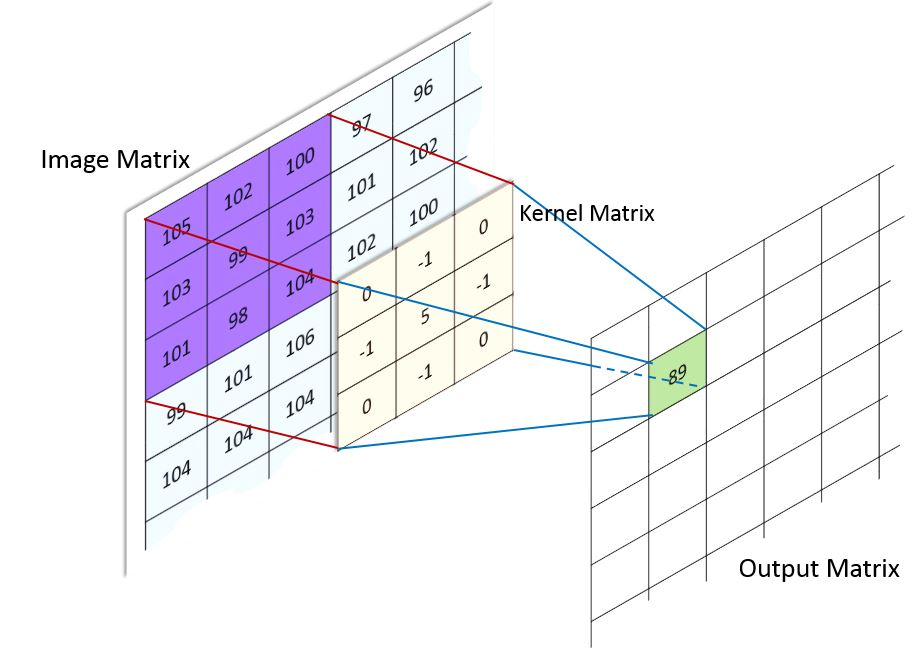
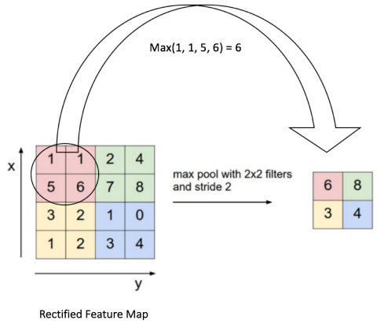
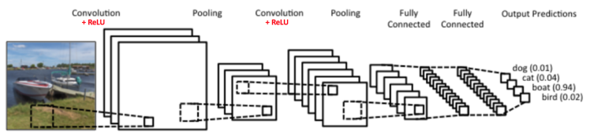
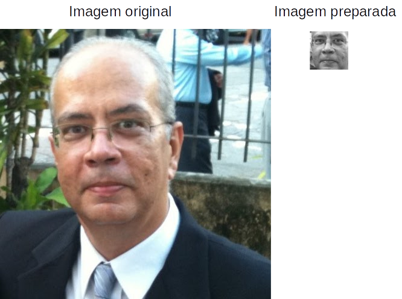
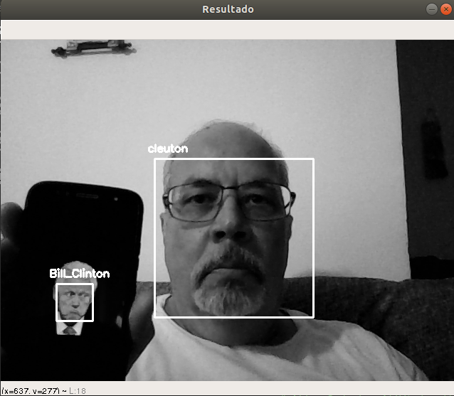

# FaceREC - CNN implementation of facial recognition
## Cleuton Sampaio - http://obomprogramador.com, http://datalearninghub.com, http://olharcomputacional.com

[](https://www.lcm.com.br/site/#livros/busca?term=cleuton)

[**PORTUGUESE** version here](https://obomprogramador.blogspot.com/2019/03/reconhecimento-e-classificacao-facial.html)

Continuing my computer vision and facial recognition articles, I'll show you a simpler and more precise face recognition method, for people identification by photos, including web and security cams.

I use Google's [**Tensorflow**](https://www.tensorflow.org/) in this demonstration to build a Convolutional Neural Network model which I've trained using some pictures of me and other public persons, like Bill Clinton.


## CNN – Convolutional Neural Network

It is a double Neural Network model composed by some convolutional layers (not all neurons are connected), dedicated to extract image features, and some dense connected layers, which classify the image by its features.

## Convolution

Convolution is the process to add each image element (pixel) to its neighbors, weighted by a kernel matrix. The kernel (our convolution matrix) indicates the factors to be multiplied by each pixel value, creating a smaller version of the image. It's used in sharpening, blurring, embossing, border detection and other image transformation operations.



Image credit: http://machinelearninguru.com/computer_vision/basics/convolution/image_convolution_1.html

The kernel is rotated (convoluted) over all image pixels, creating a smaller version, in which each point is the result of multiplication operations guided by the kernel.


## Pooling

Pooling is the process of dimensionality reduce of features, simplifiying the process and avoiding overfitting.
We can use some operations to sumarize the convolution result, like SUM or AVERAGE.



Image credit: https://ujjwalkarn.me/2016/08/11/intuitive-explanation-convnets/

## CNN layers

We have a convolutional kernel, composed by 3 layers, which can be repeated many times in a CNN, before passing the result to the dense connected part for classification:
    1. Convolution;
    2. Retifying (to add non-linearity);
    3. Pooling.

Retification remove negative values from the image, replacing them by zeros. This can be done using any common activation function, like: ReLU, Sigmoid or Tanh.



Image credit: https://ujjwalkarn.me/2016/08/11/intuitive-explanation-convnets/


## Demo code

I've created a simple process:
1. Select images from persons which I want to recognize and store them in the "raw" folder;
2. Each image must be named after the person's name, followed by a serial number, like: "cleuton.1.jpg", cleuton.2.jpg" ...
3. Run: "python trainCNN.py";
4. A model's weights file will be created. Then I use this file to load the model again using the "predict.py".

To run this program you must download and extract the [**shape_predictor_68_face_landmarks** file](http://dlib.net/files/shape_predictor_68_face_landmarks.dat.bz2).

I use [**Anaconda**](https://www.anaconda.com/) to create a virtual environment avoiding damages to your computer's python environment. Anaconda works with any operating system (MS Windows, Linux or MacOS). I am using Ubuntu 18.04.

Begin installing Anaconda and chosing Python 3.x version. Then, create a virtual environment using [**file ambiente.yml**](./ambiente.yml):
```
conda env create -f ambiente.yml
```

After some time, you can activate your virtual environment with:
```
conda activate facedet
```

## The software

[**The trainCNN.py**](./trainCNN.py) script prepare all images inside "raw" folder, separating them into "train" and "test" folders. It's important to have many different pictures of each person! The image preparation is composed by:

1. Detecting faces in each image using dlib;
2. For each face, transform it to monochromatic image;
3. For each mono image, analyze eyes angles and rotate the face upwards;
4. For each rotated image, resize it to 64 x 64 pixels.

You can see an exemple of before and after preparation here:



The CNN model is created by this code:

inputs = Input(shape=(img_h, img_w, 1))
x = conv3x3(inputs, 32)
x = conv3x3(x, 32)
x = MaxPooling2D(pool_size=(2,2))(x) 
x = conv3x3(x, 64)
x = conv3x3(x, 64)
x = MaxPooling2D(pool_size=(2,2))(x) 
x = conv3x3(x, 128)
x = MaxPooling2D(pool_size=(2,2))(x) 
x = Flatten()(x)
x = Dense(128, activation="relu")(x)
preds = Dense(nb_class, activation='softmax')(x)
model = Model(inputs=inputs, outputs=preds)

There are many convolutional layers with 3x3 filter, retification ReLU, and 2x2 polling. The final dense layer uses softmax.

[**The predict.py**](./predict.py) script uses the same model and loads the weights file created by trainCNN.py. It gets your picture using your webcam, using OpenCV. By pressing "q" in the OpenCV window, you start the classification process. Then you can see your face recognized, like the picture:



I will give you an explanation about the high precision. First, I've trained the model using older photos of mine, without the mustache and goatee, and it could successfully recognize me. Second, I've neve trained the model using a Bill Clinton's photo with that strange expression, but the model got it right again (and it's in my smartphone!)
